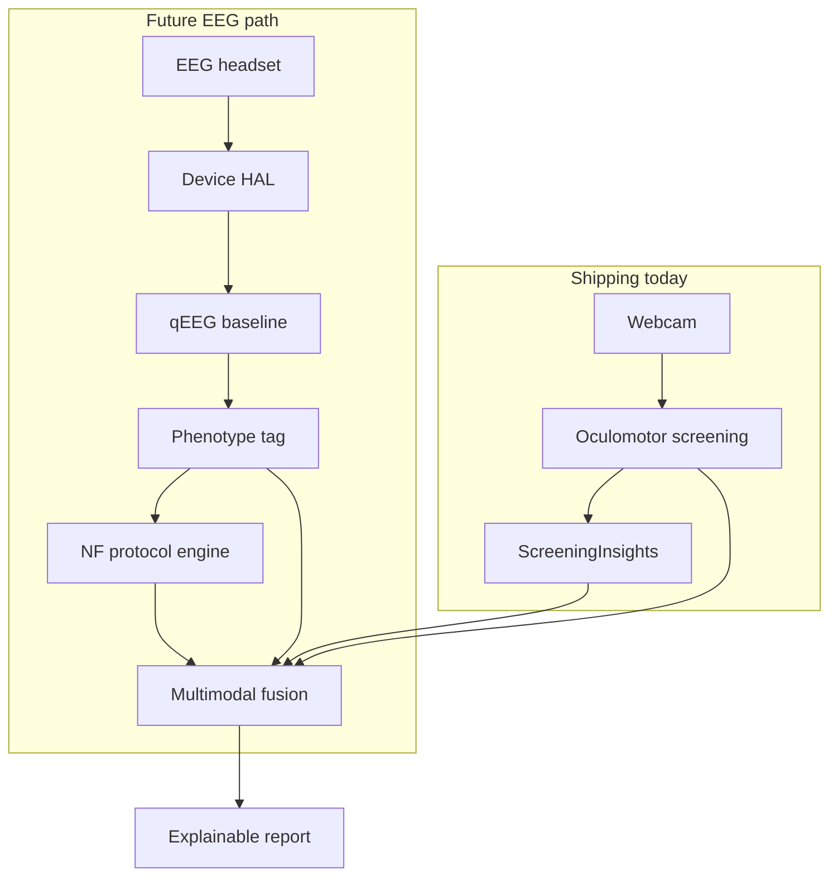

# Attune EEG Integration Roadmap

**Status:** Future / not implemented  
**Last updated:** May 2026  
**Owner:** Product + ML

Attune today uses **webcam oculomotor screening** only. This document describes a phased, evidence-aligned path to optional EEG and neurofeedback (NF)—without overclaiming theta/beta ratio (TBR) diagnostics or replacing clinical ADHD evaluation.

---

## Guiding principles

1. **Oculomotor first.** Screening and trust are built on observable executive behaviors (fixation, prosaccade, antisaccade). EEG adds a complementary layer; it does not replace the current protocol.
2. **Phenotype-informed, not biomarker-diagnostic.** qEEG guides *which NF protocol to try*, not “your child has ADHD.” Recent large-scale work shows TBR is not a reliable standalone ADHD biomarker ([multiverse analysis, 2026](https://www.medrxiv.org/content/10.64898/2026.01.08.26343676v2)).
3. **Explainability required.** Every EEG-derived conclusion must show band power, electrode site, data quality, and confounds—same standard as [`screening/insights.rs`](../attune-app/src-tauri/src/screening/insights.rs).
4. **On-device by default.** Raw EEG stays local unless the family explicitly opts into research export.
5. **No treatment claims without evidence.** NF session feedback is “training aid,” not proven therapy, until validated in Attune’s own sham-controlled studies.

---

## Relationship to current stack

| Layer | Today | With EEG (future) |
|-------|--------|-------------------|
| Screening | 3-min oculomotor tasks | Oculomotor + optional 2-min qEEG baseline |
| Learning sessions | Webcam attention + dim overlay | + optional NF protocol (SMR or theta/beta) |
| Summaries | Deterministic insights + optional Claude | + band-power trends, time-in-zone, multimodal agreement |
| Classifier | `AttuneScreening.mlmodel` (oculomotor features) | Fusion model with disagreement gating |

Shared neural basis (executive control, inhibition) motivates multimodal design; modalities remain independently interpretable.

---

## Phase 0 — Foundation (complete)

**Goal:** Trustworthy behavioral screening without EEG.

- [x] Trial-level antisaccade / prosaccade scoring
- [x] Naturalistic story viewing phase (ecological sustained attention + joint-attention probes)
- [x] Age-banded reference norms (`screening_norms.json`)
- [x] Data quality gate before interpretation
- [x] Deterministic + optional narrative summaries
- [x] Core ML classifier hook when calibrated cohort exists
- [x] Local label collection for future validation

**Exit criteria:** Parents receive a “why” summary after every screening without API keys; low-quality runs trigger retest guidance only.

---

## Phase 1 — Hardware abstraction layer

**Goal:** Ingest EEG safely from consumer/research headsets with no clinical output.

**Target devices (priority order):**

| Tier | Examples | Notes |
|------|----------|--------|
| P0 | Muse 2/Athena (BLE) | Widest home adoption; 4–8 channels |
| P1 | Emotiv Insight / EPOC X | SDK licensing required |
| P1 | OpenBCI Cyton + Ultracortex | Research / power users |
| P2 | Clinical amplifiers (e.g. BrainVision) | Clinic partnerships only |

**Engineering:**

```
attune-app/src-tauri/src/eeg/
  mod.rs           # device trait, session lifecycle
  devices/         # muse.rs, emotiv.rs, mock.rs
  signal.rs        # filtering, notch, artifact flags
  quality.rs       # impedance, motion, blink regression
```

- Tauri commands: `list_eeg_devices`, `connect_eeg`, `start_eeg_capture`, `stop_eeg_capture`
- SQLite: `eeg_sessions`, `eeg_samples` (downsampled features + optional raw blob path)
- UI: Settings → “Connect EEG headset” with live signal quality meter
- **Output:** “Signal good / poor” only—no ADHD or NF recommendations

**Exit criteria:** Stable 256 Hz ingest for 5 minutes; <5% dropped packets; artifact labels logged.

---

## Phase 2 — qEEG baseline & phenotype tagging

**Goal:** Short baseline maps individual spectral profile for protocol *suggestion*, not diagnosis.

**Protocol (add-on to screening flow, ~2 minutes):**

1. Eyes open rest (60 s)
2. Eyes closed rest (60 s)

**Features (IAF-aware, aperiodic-aware):**

- Individual alpha frequency (IAF)
- Aperiodic 1/f slope (separate from oscillatory power)
- Relative theta, beta, SMR at Fz, Cz, C3, C4 (when montage allows)
- Frontal theta/beta ratio — reported with wide uncertainty, not as cutoff

**Phenotype tags (informational):**

| Tag | Spectral pattern | Typical NF protocol direction |
|-----|------------------|-------------------------------|
| `frontal_theta_elevated` | High resting theta at Fz/Cz | Theta down / beta up at Fz |
| `low_smr` | Low 12–15 Hz at Cz | SMR uptraining at Cz |
| `mixed` | Multiple deviations | Combined or sequential protocols |
| `insufficient_data` | Artifacts / short recording | Retest |

**Integration with oculomotor screening:**

- If oculomotor antisaccade errors **and** frontal theta tag both elevated → higher confidence “executive attention pattern” insight (still non-diagnostic)
- If modalities **disagree** → insight confidence downgraded; summary says “mixed signals—retest or consult clinician”

**Exit criteria:** Reproducible baseline features test–retest r > 0.7 in internal pilot (n ≥ 20); phenotype tags never shown without quality gate pass.

---

## Phase 3 — Protocol-guided neurofeedback during learning

**Goal:** Closed-loop NF as optional adjunct during learning sessions—not a standalone cure.

**Protocols (qEEG-selected):**

| Protocol | Sites | Bands | Primary symptom target (literature) |
|----------|-------|-------|-------------------------------------|
| Theta/beta | Fz or Cz | ↓4–8 Hz, ↑13–21 Hz | Inattention |
| SMR | Cz, C3/C4 | ↑12–15 Hz, ↓theta | Hyperactivity / motor restlessness |
| SCP (future) | Cz | Slow cortical potentials | Inhibition (research-grade) |

**Session design:**

- 20–30 min learning block with embedded NF feedback (visual bar or Attune overlay coupling)
- Track **compliance metrics:** `% time in target band`, artifact-free seconds, breaks
- Course length: 20–30 sessions before outcome review (aligned with NF literature)

**Feedback coupling with existing attention layer:**

- NF reward signal modulates dim intensity or gentle cue—not punishment
- Webcam engagement score and EEG band power logged separately for post-hoc analysis

**Exit criteria:** Sham-controlled internal pilot (n ≥ 30) showing NF group improves oculomotor antisaccade error rate vs sham; no symptom diagnosis claims in UI.

---

## Phase 4 — Multimodal fusion & clinician export

**Goal:** Single report combining oculomotor + EEG with explicit uncertainty.

**Report additions:**

- Side-by-side: antisaccade error rate vs baseline theta/SMR z-scores (age-normed)
- Multimodal agreement score
- Session-over-session trends for both modalities
- Export: PDF + JSON for pediatrician/neuropsychologist (parent-initiated)

**ML:**

- Retrain screening classifier on fused features
- Require modality agreement for high-confidence flags
- SHAP/LIME-style feature attributions in parent-facing copy

**Exit criteria:** Fusion model AUC ≥ oculomotor-only on held-out labeled cohort; every prediction has human-readable attribution.

---

## Phase 5 — Clinical & regulatory path (parallel track)

**Not a shipping gate for Phases 1–3 beta**, but required for any diagnostic or treatment claims.

| Milestone | Activity |
|-----------|----------|
| IRB | Pediatric home EEG + oculomotor observational study |
| Validation | Compare to Conners/ASRS + clinician blinded review (subset) |
| Sham NF | Double-blind RCT for NF efficacy claims |
| Regulatory | Determine wellness vs SaMD (FDA) / UKCA / CE MDR class |
| Privacy | COPPA-compliant; no child EEG cloud without parental consent |

---

## Proposed data model (future migrations)

```sql
-- attune-v6-eeg.sql (draft)
CREATE TABLE eeg_sessions (
  id TEXT PRIMARY KEY,
  screening_id TEXT,          -- optional link
  learning_session_id TEXT,   -- optional link
  device_id TEXT,
  montage TEXT,
  started_at INTEGER,
  ended_at INTEGER,
  quality_json TEXT,
  phenotype_tag TEXT
);

CREATE TABLE eeg_band_features (
  eeg_session_id TEXT,
  ts REAL,
  site TEXT,
  band TEXT,
  power REAL,
  artifact_free INTEGER
);

CREATE TABLE nf_protocol_runs (
  id TEXT PRIMARY KEY,
  learning_session_id TEXT,
  protocol TEXT,              -- theta_beta | smr
  target_site TEXT,
  time_in_zone_pct REAL,
  compliance_json TEXT
);
```

---

## Architecture diagram



---

## What Attune will not do (even with EEG)

- Claim TBR or any single EEG metric **diagnoses** ADHD
- Replace medication, IEP, or clinician assessment
- Train on cloud EEG without explicit opt-in
- Show NF “success” without sham-controlled validation
- Market as neurofeedback **therapy** before regulatory clearance

---

## Dependencies & open questions

| Item | Decision needed |
|------|-----------------|
| Device SDK licenses | Emotiv commercial terms |
| Pediatric electrodes | Partner with child-sized consumables vendor |
| Home vs supervised NF | Default home with strong quality gates; clinic mode later |
| Theta/beta vs SMR default | qEEG phenotype-driven; no one-size-fits-all |
| Integration point | Baseline at screening; NF during learning sessions |

---

## Suggested timeline (indicative)

| Phase | Target | Depends on |
|-------|--------|------------|
| 0 | Done | — |
| 1 | Q3 2026 | Device SDK + BLE stability |
| 2 | Q4 2026 | Phase 1 + normative pediatric EEG dataset |
| 3 | H1 2027 | Phase 2 + NF UX design |
| 4 | H2 2027 | Labeled multimodal cohort |
| 5 | 2027+ | IRB + regulatory counsel |

---

## References (selection)

- Oculomotor ADHD meta-analyses — antisaccade errors as robust behavioral marker
- [Frontiers 2024 portable eye-tracking ML screening](https://www.frontiersin.org/journals/psychiatry/articles/10.3389/fpsyt.2024.1337595/full)
- [TBR multiverse analysis (2026)](https://www.medrxiv.org/content/10.64898/2026.01.08.26343676v2) — do not use TBR as sole biomarker
- [AJP neurofeedback review (2022)](https://psychiatryonline.org/doi/full/10.1176/appi.ajp.20220861) — mixed efficacy; sham control essential
- Heinrich et al. — theta/beta and SMR NF protocols in ADHD (protocol reference)

---

## Related docs

- [ml/README.md](../ml/README.md) — current on-device ML pipeline
- [screening_norms.json](../attune-app/src-tauri/resources/screening_norms.json) — oculomotor reference bands
- In-app: Parent dashboard → **Science & roadmap**
